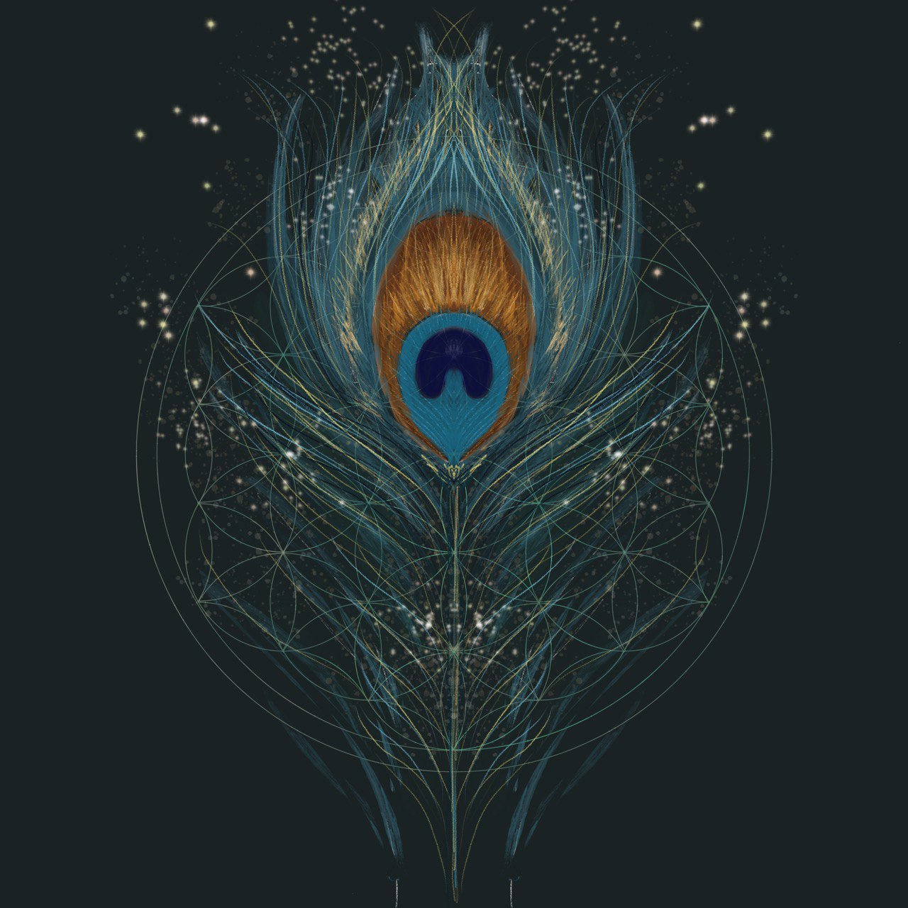

# Varna Priya - Update Notes

## Recent Updates

### 1. New Color Palette (Peacock Feather Theme)

The website has been updated to match your beautiful peacock feather artwork. The new color scheme includes:

**Primary Colors:**
- Teal Primary: `#0d9488`
- Bronze/Copper: `#c87137`
- Gold Accent: `#c9a961`

**Background Colors:**
- Dark Background: `#1a2e2e`
- Darker Background: `#0f1d1d`

**Additional Colors:**
- Teal Dark: `#0a5f5a`
- Teal Bright: `#00a3a3`
- Bronze: `#d4823b`
- Navy: `#1a3d5c`

All gradients, shadows, and UI elements have been updated to use this cohesive peacock-inspired palette.

### 2. Hero Image Integration

- Your peacock feather mandala (`Visuals.jpg`) is now displayed prominently on the homepage
- The image has a seamless blend with the background color (`#1a2e2e`)
- Added elegant fade-in animation and subtle glow effect
- Image is responsive and scales beautifully on all devices

### 3. English/Russian Language Toggle

A fully functional language switcher has been added to all pages:

**Features:**
- Toggle button in the navigation bar (EN/RU)
- Instant language switching without page reload
- Language preference saved in browser localStorage
- All navigation items translate automatically
- Main content sections have Russian translations

**How It Works:**
- All text elements have `data-en` and `data-ru` attributes
- JavaScript switches between languages dynamically
- Users' language preference persists across page visits

**Translated Pages:**
- Homepage (index.html) - Fully translated
- Portfolio (portfolio.html) - Navigation translated
- Blog (blog.html) - Navigation translated
- Resources (resources.html) - Navigation translated
- About (about.html) - Navigation translated
- Blog Post (blog-post-1.html) - Navigation translated

### 4. Updated Design Elements

**Starfield Background:**
- Background color updated to match peacock feather artwork
- Stars blend naturally with the teal-green aesthetic

**Buttons & CTAs:**
- All gradients updated to teal → bronze
- Hover effects use the new color palette
- Ko-fi buttons maintain brand colors with new accents

**Cards & Sections:**
- Feature cards use new gradient backgrounds
- Portfolio items showcase teal-bronze-gold gradients
- All borders and shadows updated to teal accents

## Implementation Details

### Color Variables (css/style.css)
```css
:root {
    --primary-color: #0d9488;
    --secondary-color: #c87137;
    --accent-color: #c9a961;
    --dark-bg: #1a2e2e;
    --darker-bg: #0f1d1d;
    --teal-dark: #0a5f5a;
    --teal-bright: #00a3a3;
    --bronze: #d4823b;
    --navy: #1a3d5c;
    --gold: #c9a961;
}
```

### Language Toggle (js/main.js)
- Language switcher saves preference to localStorage
- Automatic translation on page load
- Smooth transitions between languages
- HTML lang attribute updates for accessibility

### Hero Image (index.html)
```html
<div class="hero-image-container">
    
</div>
```

## Testing Checklist

- [x] Color scheme matches reference image
- [x] Hero image displays correctly
- [x] Background blends seamlessly
- [x] Language toggle works on all pages
- [x] Russian translations display properly
- [x] Language preference persists
- [x] Mobile responsive design maintained
- [x] All gradients updated
- [x] All shadows updated
- [x] Navigation works on all pages

## Next Steps (Optional)

1. **Add More Russian Translations**: Currently only navigation and homepage are fully translated. You can add more `data-ru` attributes to other pages.

2. **Replace Placeholder Images**: Add your actual artwork to the portfolio, blog, and resources pages.

3. **Customize Social Links**: Update Instagram and Ko-fi links with your actual handles.

4. **Add More Languages**: The system can easily be extended to support additional languages (just add more `data-xx` attributes).

5. **Optimize Images**: Compress the Visuals.jpg file for faster loading if needed.

## File Structure

```
VarnaPriya/
│
├── Visuals.jpg              # Your peacock feather hero image
├── index.html              # Homepage (fully translated)
├── portfolio.html          # Portfolio with language toggle
├── blog.html               # Blog with language toggle
├── resources.html          # Resources with language toggle
├── about.html              # About with language toggle
├── blog-post-1.html        # Sample post with language toggle
│
├── css/
│   └── style.css           # Updated with peacock color palette
│
├── js/
│   └── main.js             # Language toggle functionality added
│
└── README.md               # Setup instructions
```

## Browser Compatibility

- Chrome/Edge: Full support
- Firefox: Full support
- Safari: Full support
- Mobile browsers: Full support

## Performance

- No additional libraries required
- Language switching is instant
- localStorage for persistence
- Optimized CSS with CSS variables

---

**Created with cosmic energy** ✨
